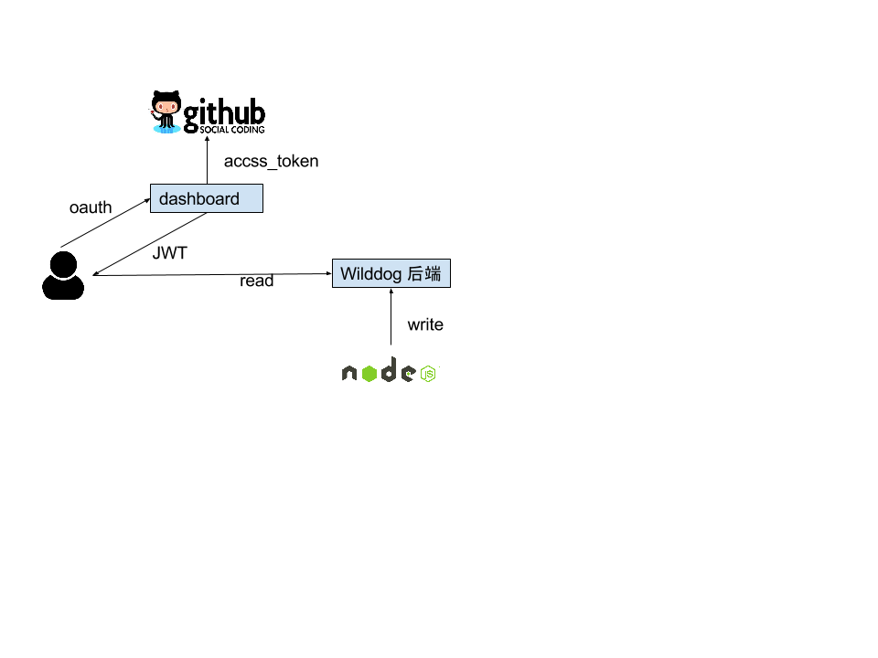

# v8-memory-dashboard
基于 `野狗` 打造一个 `v8` 内存分配的实时仪表盘。

## 使用步骤

- 在 `Node.JS` 应用里装上 [v8-memory-dashboard-client](https://github.com/wyvernnot/v8-memory-dashboard-client) 模块, 注意 `Node.JS` 版本最低要求是 `6.0.0`
- 打开 DEMO 页面 [longtian-v8.daoapp.io](http://longtian-v8.daoapp.io/), 使用 `Github` 账号登录
- 按照页面上的提示, 在代码里引入模块
- 重新启动应用, 很快就能看到 `v8` 的内存数据

## 独立部署

`DEMO` 用的是免费的 `Wilddog` 账号, 因此流量和并发数有限。你也可以独立部署自己的服务器, 服务器使用 `Docker` 镜像的方式发布。

[](https://hub.docker.com/r/wyvernnot/v8-memory-dashboard/)

### 运行

```sh
docker run -p 8080:8080 wyvernnot/v8-memory-dashboard \
  -e WILDDOG_URL=<>     \
  -e WILDDOG_SECRET=<>  \
  -e CLIENT_ID=<>       \
  -e CLIENT_SECRET=<>
```

### 配置

| 环境变量            |  备注                       |
|--------------------|-----------------------------|
|WILDDOG_URL         |  野狗的应用的 ROOT URL       |
|WILDDOG_SECRET      |  野狗超级密匙, 用于生成 token  |
|CLIENT_ID           |  Github OAuth CLIENT_ID     |
|CLIENT_SECRET       |  Github OAuth CLIENT_SECRET |

## 原理



- 通过 `Github OAuth` 取得 `Github` 用户信息
- 利用野狗的密匙 `WILDDOG_SECRET` 并结合 `GITHUB` 用户信息, 使用 `JWT` 算法生成一个包含用户 `UID` 的 `token`
- 用户在浏览器端通过该 `token` 连接到 `Wilddog` 服务器并通过认证
- `v8-memory-dashboard-client` 会定期把数据写入 `Wilddog` 后台
- `Wilddog` 后台在写入的时候不做认证, 但是读取的时候做认证, 保证用户登录后只能看到自己的数据
- `dashboard` 服务器负责 `Github OAuth` 过程和生成 `JWT` 的 `token`, 本身不存储或转发任何 `v8` 的数据

## 规则表达式

```json
{
  "rules": {
    "$user_id": {
      ".read": "$user_id == auth.uid",
      ".write": true
    }
  }
}
```

[编辑图片](https://docs.google.com/drawings/d/1ha1_rxfchymF4cSZR8EfVxfcUVH7JGMTPmHHILPAtks/edit?usp=sharing)

## 开源协议

MIT

