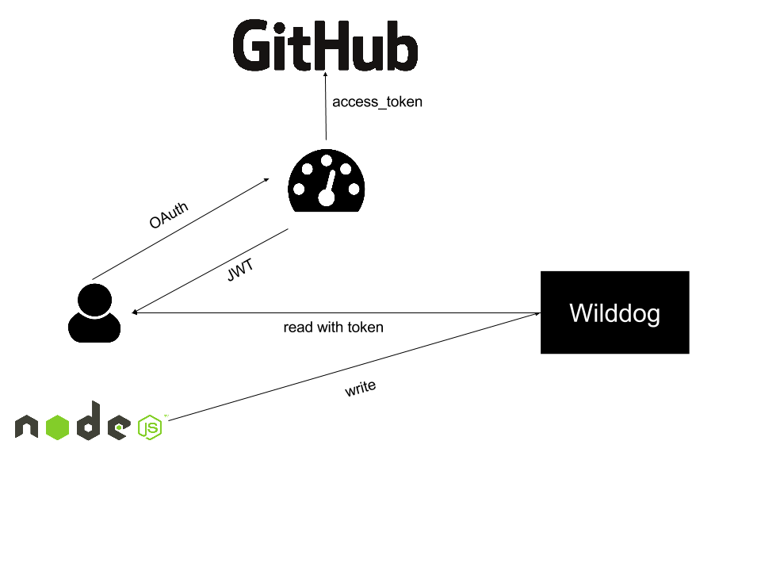

# v8-memory-dashboard
基于 `野狗` 打造一个能够看到 `v8` 实时内存占用的仪表盘。

## 使用步骤

- 在你的应用里装上 `v8-memory-dashboard-client` 模块
- 打开 DEMO 页面 [longtian-v8.daoapp.io](http://longtian-v8.daoapp.io/), 使用 `Github` 登录
- 按照页面上的提示, 在代码里引入模块
- 重新启动应用, 马上就能看到 `v8` 的内存数据

## 独立部署

`DEMO` 用的是免费的 Wilddog 账号, 因此流量和并发数有限。

你也可以独立部署自己的服务器, 服务器使用 `Docker` 镜像的方式发布。

[](https://hub.docker.com/r/wyvernnot/v8-memory-dashboard/)

### 运行

```sh
docker run -p 8080:8080 wyvernnot/v8-memory-dashboard \
  -e WILDDOG_URL
  -e WILDDOG_SECRET
  -e CLIENT_ID
  -e CLIENT_SECRET
```

### 配置

| 环境变量            |  备注                       |
|--------------------|-----------------------------|
|WILDDOG_URL         |  野狗的 API                 |
|WILDDOG_SECRET      |  野狗 Secret 用于生成 JWT    |
|CLIENT_ID           |  Github OAuth CLIENT_ID     |
|CLIENT_SECRET       |  Github OAuth CLIENT_SECRET |

## 原理



- 登录用户只能看到自己的数据
- 使用 `Github` 验证用户身份, 并转换成 `Wilddog` 支持的 `JWT`
- Node.JS 会定期把数据写入 `Wilddog`

[编辑图片](https://docs.google.com/drawings/d/1ha1_rxfchymF4cSZR8EfVxfcUVH7JGMTPmHHILPAtks/edit?usp=sharing)

## 开源协议

MIT

